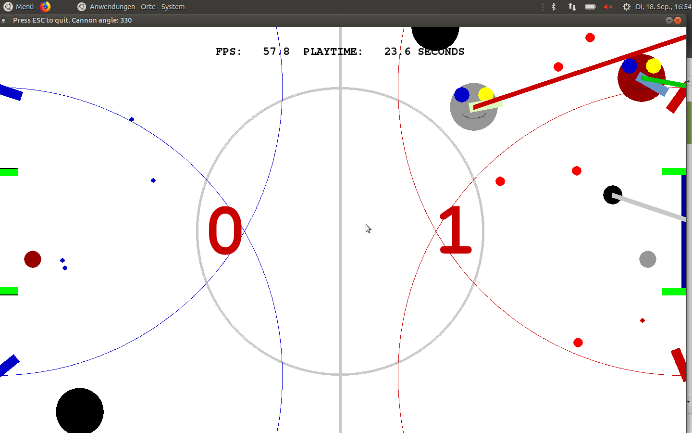
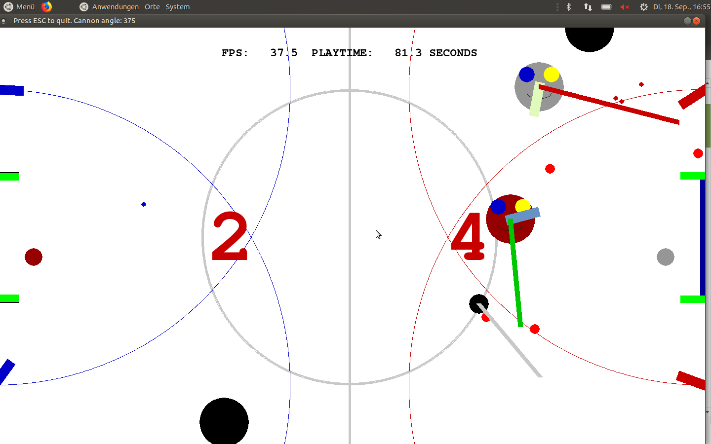

# ballwars
*This is a simple Game where your Goal is to win against your Opponent.
You can either play against an AI or against another Player with Bouncers that you cant disable.
In this Game you win by scoring an amount of Goals that you can choose in the Settings Menu
But be aware that there are Mini-Cannons that shoot at you but prioritize the Lazyball
And you can shoot in this Game using Cannons that are attached to your Ball.
There are 2 Difficulties that you can choose*

### Normal Mode

**Your Opponent only dashes at you every few Seconds and not even close to as fast as Extreme Mode**

### Extreme Mode

**Your Opponent dashes at you very often and very quickly and may even break the Game, to reset the Balls use**
1. Player1:
Use 8
1. Player2 or the AI:
Use 9
1. The Lazyball:
Use 0
 

 
### Controls
Moving the ball:Using the left stick on your controller

Moving the Cannon:Using L1 and R1/LB and RB

Shooting:B

# Credits
BIGm0 and BakTheBig and HorstJens

Note:you need python3 from https://www.python.org/downloads/
python 3 needed!
and you need pygame from https://www.pygame.org/download.shtml

